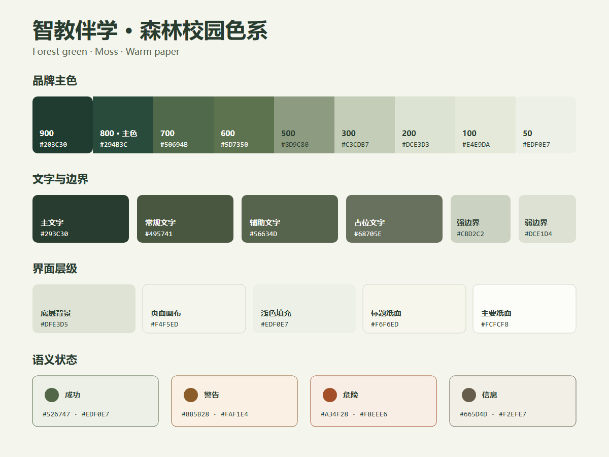

# 智教伴学 UI 色彩系统

> 基于 `web/src/campus-theme.css`、`campus-depth.css`、`teacher-ui.css` 与 `student-ui.css` 的当前实际样式整理。当前主视觉定义为「森林校园」：森林绿、苔藓灰绿、暖纸白。



## 1. 品牌主色

| Token | 色值 | 建议用途 |
| --- | --- | --- |
| `--color-brand-900` | `#203C30` | 按下态、深色强调 |
| `--color-brand-800` | `#294B3C` | 品牌主色、主按钮、选中态、链接 |
| `--color-brand-700` | `#50694B` | 悬停态 |
| `--color-brand-600` | `#5D7350` | 焦点环、页签指示条 |
| `--color-brand-500` | `#8D9C80` | 次级边框、滚动条 |
| `--color-brand-300` | `#C3CDB7` | 弱强调边框 |
| `--color-brand-200` | `#DCE3D3` | 选区、弱选中背景 |
| `--color-brand-100` | `#E4E9DA` | 树节点/标签选中背景 |
| `--color-brand-50` | `#EDF0E7` | 浅色填充、表头、悬停背景 |

主按钮状态固定为：默认 `#294B3C` → 悬停 `#50694B` → 按下 `#203C30`。不要再引入另一套青绿按钮色。

## 2. 中性色与界面层级

| Token | 色值 | 建议用途 |
| --- | --- | --- |
| `--color-text-primary` | `#293C30` | 标题、正文主信息 |
| `--color-text-regular` | `#495741` | 常规正文 |
| `--color-text-secondary` | `#56634D` | 辅助文案、说明 |
| `--color-text-placeholder` | `#68705E` | 占位文字、低优先级信息 |
| `--color-border-strong` | `#CBD2C2` | 输入框、控件边框 |
| `--color-border-default` | `#D2D8C7` | 卡片/面板边界 |
| `--color-border-subtle` | `#DCE1D4` | 分隔线、弱边界 |
| `--color-border-faint` | `#E7EADD` | 最弱分隔线 |
| `--color-bg-backdrop` | `#DFE3D5` | 工作区最底层背景 |
| `--color-bg-canvas` | `#F4F5ED` | 页面画布 |
| `--color-bg-subtle` | `#EDF0E7` | 表头、列表悬停、浅填充 |
| `--color-bg-heading` | `#F6F6ED` | 页面标题纸面 |
| `--color-bg-surface` | `#FCFCF8` | 卡片、弹窗、导航、主要纸面 |

界面层级从下到上为：`backdrop` → `canvas/subtle` → `heading` → `surface`。整个系统使用暖白，不建议用纯白 `#FFFFFF` 替代主要纸面。

## 3. 语义状态色

| 状态 | 主色 | 深色 | 浅背景 | 用途 |
| --- | --- | --- | --- | --- |
| 成功 | `#526747` | `#405337` | `#EDF0E7` | 完成、通过、正常 |
| 警告 | `#8B5B28` | `#734A20` | `#FAF1E4` | 待处理、注意、风险 |
| 危险 | `#A34F28` | `#853D1C` | `#F8EEE6` | 删除、失败、阻断 |
| 信息 | `#665D4D` | — | `#F2EFE7` | 中性提示、说明 |

状态色只表达含义，不用于大面积装饰。正文或图标使用主色，容器使用浅背景；需要边框时采用同色系的中间阶。

## 4. 推荐 CSS Token

```css
:root {
  /* Brand */
  --color-brand-900: #203c30;
  --color-brand-800: #294b3c;
  --color-brand-700: #50694b;
  --color-brand-600: #5d7350;
  --color-brand-500: #8d9c80;
  --color-brand-300: #c3cdb7;
  --color-brand-200: #dce3d3;
  --color-brand-100: #e4e9da;
  --color-brand-50: #edf0e7;

  /* Text */
  --color-text-primary: #293c30;
  --color-text-regular: #495741;
  --color-text-secondary: #56634d;
  --color-text-placeholder: #68705e;

  /* Border */
  --color-border-strong: #cbd2c2;
  --color-border-default: #d2d8c7;
  --color-border-subtle: #dce1d4;
  --color-border-faint: #e7eadd;

  /* Surface */
  --color-bg-backdrop: #dfe3d5;
  --color-bg-canvas: #f4f5ed;
  --color-bg-subtle: #edf0e7;
  --color-bg-heading: #f6f6ed;
  --color-bg-surface: #fcfcf8;

  /* Status */
  --color-success: #526747;
  --color-success-bg: #edf0e7;
  --color-warning: #8b5b28;
  --color-warning-bg: #faf1e4;
  --color-danger: #a34f28;
  --color-danger-bg: #f8eee6;
  --color-info: #665d4d;
  --color-info-bg: #f2efe7;
}
```

## 5. 使用比例与可访问性

- 约 60% 使用暖纸白与浅灰绿背景，30% 使用文字、边框和容器层级，10% 以内使用品牌主色与状态色。
- `#294B3C` 与 `#FCFCF8` 的对比度约为 `9.43:1`，适合按钮和正文；主文字 `#293C30` 约为 `11.45:1`。
- 辅助文字 `#56634D` 约为 `6.21:1`，占位色 `#68705E` 约为 `5.02:1`，在暖纸白上均可满足普通文本的 WCAG AA 对比要求。
- 浅阶品牌色只作为背景或边框，不直接承载小字号文字。

## 6. 需要逐步收口的遗留颜色

源码中仍存在两组旧视觉：蓝色系（如 `#3457D5`、`#15234D`）和旧青绿色系（如 `#23746F`、`#378F81`）。现行 `campus-theme.css` 通过加载顺序覆盖了多数场景，但部分组件内的 scoped 样式仍可能显示旧色。

后续维护建议：

1. 新增样式只使用本页 token，不再直接写十六进制颜色。
2. 将 `#23746F` / `#378F81` 分别迁移为 `--color-brand-800` / `--color-brand-600`。
3. 将纯白 `#FFFFFF` 迁移为 `--color-bg-surface`；仅在图片、图表或确需纯白的内容中保留。
4. 蓝色遗留样式不再扩展，按页面逐步移除。
